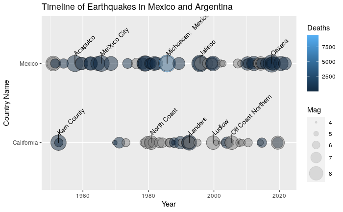
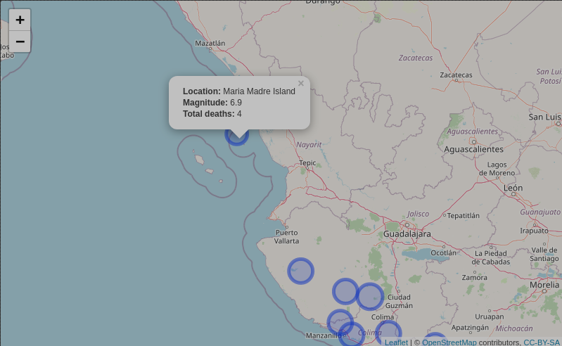

# MSDRCapstone

<!-- badges: start -->
[](https://github.com/csprock/msdr_capstone/actions/workflows/check-release.yaml)
<!-- badges: end -->

Completes the requirements for the "Mastering Software Development in R" Capstone project for Coursera. 

## Notes for Graders

I have made the following modifications to the assignment:

* Github Actions is used instead of TravisCI because Travis no longer supports open source projects for free
* only exported functions have examples

## Installation

You can install the development version of MSDRCapstone from [GitHub](https://github.com/) with:

``` r
# install.packages("devtools")
devtools::install_github("csprock/msdr_capstone")
```

## Sample Output

#### Timeline Geom



#### Leaflet Map

